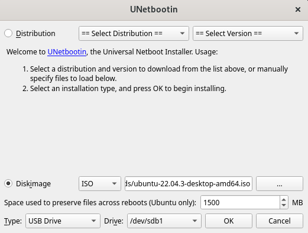
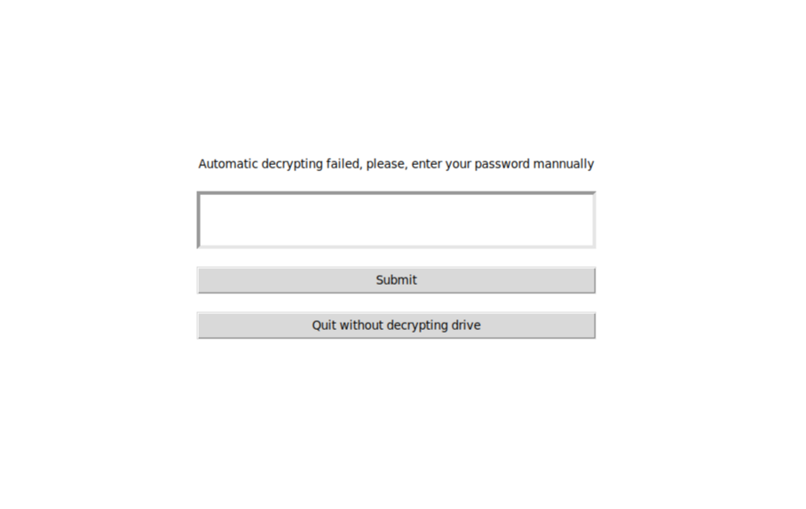
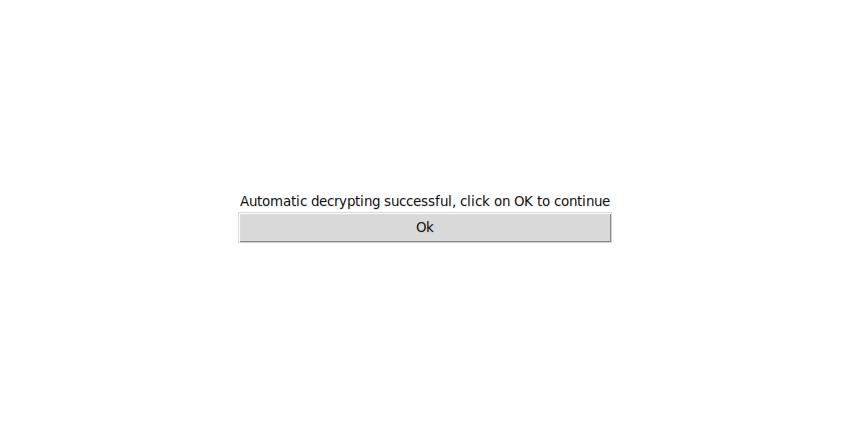
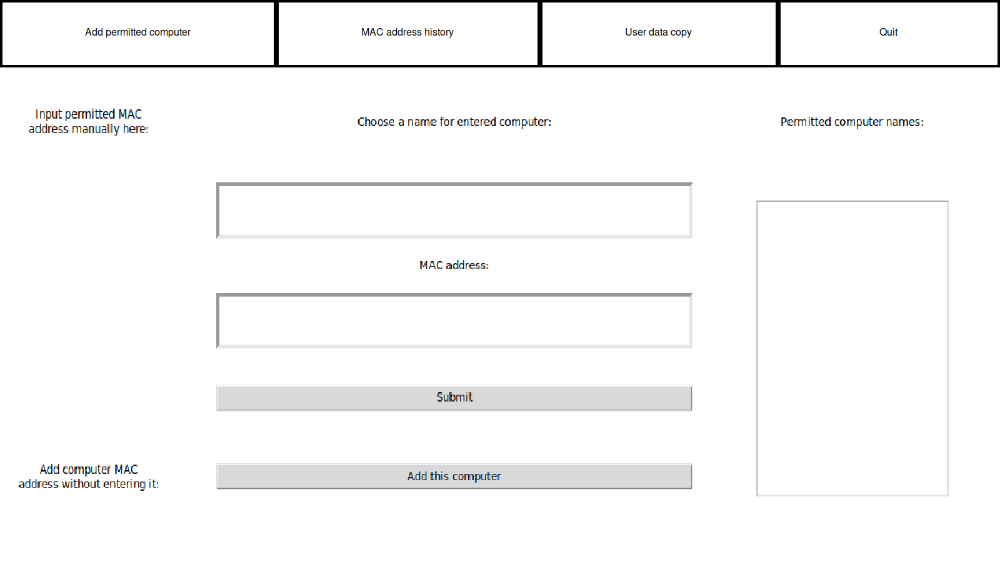
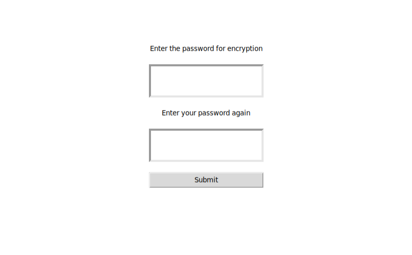
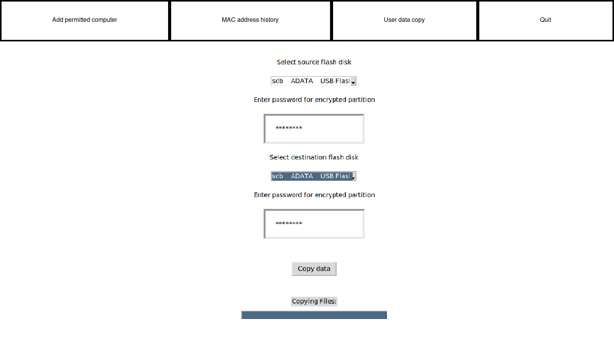

# Encryption of data on USB flash drive

## Overview

This is a system for automatic encryption of data on a selected partition of a USB drive. The system 
will provide access to the data based on the identification of the computer to which the USB drive is connected. 

Application is written in Python language and allows to edit the list of allowed computers and display 
the history of USB drive connections to computers. The application will be part of the operating system for seniors. 

## Features

- Automatically decrypts data on a USB drive partition.
- Grants access to encrypted data based on the MAC address of the connected computer.
- Application for managing the list of allowed computers and displaying connection history.
- The backup and copy of user data on the encrypted partition

## Installation

### Environment Preparation

Before installing Ssec, ensure the following environment is setup:

1. Prepare a USB drive with at least 16GB of space.

2. Make sure your drive has no partitioned space. If you are unsure, use program fdisk 
(comes with most Linux distributions) to check partitioned space or delete existing 
partitions. Before working with fdisk, make sure that your USB drive and/or partitions
are unmounted.
	These commands must be run with root privileges:
	```bash
	umount /dev/sdXY
	```
	```bash
	fdisk /dev/sdX
	```
	Your command can look like this:
	```bash
	sudo umount /dev/sdb1
	```
	```bash
	sudo fdisk /dev/sdb
	```
	Replace X with the letter of your drive. You can check all disks in the system using the command:
	Usually USB drives are /dev/sdb. Partitions 
	```bash
	lsblk -l
	```
	After running fdisk with the correct USB drive, delete **ALL** partitions currently on it. This will 
	**DESTROY** all data on the USB disk, make sure you backup your data.
	```bash
	fdisk /dev/sdX
	Command (m for help): d
	Partition number (1-4): 1
	```
	
	Then create new partitions. It is recommended to make the first partition 8GB and the second partition
	4GB. If you have a bigger flash disk, you can adjust the size of the second partition, it is where user data
	is stored.
	```bash
	Command (m for help): n
	Partition type
		p	primary (0 primary, 0 extended, 4 free)
		e	extended (container for logical partitions)
	Select (default p): p
	Partition number (1-4, default 1): 1
	First sector (2048-30310399, default 2048): [press enter for default]
	Last sector, +/-sectors or +/-size{K,M,G,T,P} (2048-30310399, default 30310399): +8G
	```
	Then create the second partition:
		
	```bash
	Command (m for help): n
	Partition type
		p	primary (0 primary, 0 extended, 4 free)
		e	extended (container for logical partitions)
	Select (default p): p
	Partition number (2-4, default 2): 2
	First sector (16779264-30310399, default 16779264): [press enter for default]
	Last sector, +/-sectors or +/-size{K,M,G,T,P} (16779264-30310399, default 30310399): +4G
	```
	After doing these changes, write and save.
	```bash
	Command (m for help): w
	```

4. Format first partition on your USB drive to the ext4 file system:
	```bash
	mkfs -t ext4 /dev/sdX1
	```
	Your command can look like this:
	```bash
	sudo mkfs -t ext4 /dev/sdb1
	```

6. Mount your USB drive or simply remove it from your computer and insert it back in. Re-inserting the 
drive will automatically mount the drive. If you want to mount it mannually, use the mount command:
	```bash
	mount <device> <mount point>
	```
	Your command can look like this:
	```bash
	mount /dev/sdb1 /mnt
	```

7. Run UNetbootin. If you do not have it installed, visit https://unetbootin.github.io/ and folow the 
instructions for instalation.

	```bash
	sudo unetbootin
	```

	Select Diskimage and find Ubuntu iso file on your system. It is recommended 
	to download the iso file of Ubuntu directly from https://ubuntu.com/download rather than using UNetbootin
	to download the iso file for you.

	

	Choose 1.5 GB of data persistent space. Choose the first partition 
	on your disk. Confirm the instalation.


### Program Installation

Boot into the operating system on your flash drive. To install Ssec, follow these steps:

1. Make sure **Python**, **pip** and **git** is installed on your system.

2. Clone this repository to your system.

3. Install the necessary dependencies:
	Either with pip requrements file:
	```bash
	pip install -r requirements.txt
	```
	Or you can install these packages directly (recommended):
	```bash
	apt install python3-pycryptodome
	apt install python3-tk
	pip install argon2-cffi
	```

4. Run the install.sh script and follow the instructions. Make sure the script can be executed.
If it cannot, run the chmod command bellow.
	```bash
	./install.sh
	```
	```bash
	sudo chmod +x install.sh
	```
5. Directory /ssec can only be accessed by root user. Reset root password with the command sudo passwd
and then login as root user with su command:
	```bash
	sudo passwd root
	```
	```bash
	su root
	```
 
## Usage

### Encryption
Data are encrypted using LUKS after running the install.sh script. LUKS is used when the script 
asks for a password. **Remember this password or you will be unable to access your data!**

After booting, you will be greeted by either 




### Access Control

To manage allowed computers and view connection history run the Python application provided.
Make sure you have root priviliges. Run /ssec/ssec_app.py using this command:
```bash
python3 ssec_app.py
```

To add an allowed computer, enter an alias for the computer and input a MAC address of a computer
mannually or use the add this computer button. You can wiew the allowed computer in the window 
on the right.



After inputting the adddress, further inputting will be blocked and you will be asked to restart
the computer. 


After restarting, you will be prompted for LUKS encryption password. After inputting your password,
your operating system will automatically decrypt at the target computer.



To view history of computers, in which the USB drive was, simply click the MAC history button in the
top menu.


### User data backup


